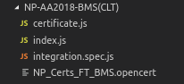

# Integration Test

Integration tests are added to custom certificate templates to ensure that incremental changes made to the website repository (whether by core developers or other template developers) do not break your certificate. In addition, these integration test helps to get your certificate template approved and merged by the maintainer faster as the testing process is automated.

## Running the integration test (visually)


To run the integration test to see how the test navigates around the application, simply run the web application AND the integration test in two separate shells.

Running the web application

```sh
npm run dev
```

Running the integration test (with chrome)
```sh
npm run integration
```

## Running the integration test (headless, on built application)

The code is automatically tested using on Travis. The application is first built and then the integration test will run in the headless (no browser UI) mode. The command to replicate the same test process is:

```sh
npm run build:static
npm run integration:headless
```

\* The full travis script can be found in the file `.travis.yml` in the opencerts-website repository.

## Writing the integration test

The integration test is written with [TestCafe](https://devexpress.github.io/testcafe/), in javascript. You may refer to the [Getting Started](https://devexpress.github.io/testcafe/documentation/getting-started/) guide by TestCafe to get started or when in doubt.

### File Structure



Integration test files in the repository have `.spec.js` file extensions. These will be picked up and run by testcafe automatically. 

We recommend having the test file in the same place as the template file, together with a corresponding sample of the `.opencert` file. 


### Code Stucture

Below is a sample code for testing an OpenCerts template with two template tabs - the certificate and transcript. 

The test checks for the presence of specific text that are rendered with the certificate template. You may include  test for other aspects of the certificate not limited to the presence of text.

```js
// eslint-disable-next-line import/no-extraneous-dependencies
import { Selector } from "testcafe";

// eslint-disable-next-line
fixture("YOUR INSTITUTE NAME").page`http://localhost:3000`;

const Certificate = "./A_SAMPLE_CERTIFCATE.opencert";

const TemplateTabList = Selector("#template-tabs-list");
const RenderedCertificate = Selector("#rendered-certificate");

const validateTextContent = async (t, component, texts) =>
  texts.reduce(
    async (prev, curr) => t.expect(component.textContent).contains(curr),
    Promise.resolve()
  );

test("BMS certificate is rendered correctly", async t => {
  // Uploads certificate via dropzone
  await t.setFilesToUpload("input[type=file]", [Certificate]);

  // Certificate tabs rendered
  await t.expect(TemplateTabList.textContent).contains("Certificate");
  await t.expect(TemplateTabList.textContent).contains("Transcript");

  // Certificate tab content
  await validateTextContent(t, RenderedCertificate, [
    "STUDENT_NAME",
    "CERTIFICATE_NAME",
    "SPECIALISATION",
    "PRINCIPAL_NAME",
    "CHAIRMAN_NAME"
  ]);

  // Navigate to Transcript tab
  const transcriptTab = TemplateTabList.find(":nth-child(2)");
  await t.click(transcriptTab);

  // Transcript tab content
  await validateTextContent(t, RenderedCertificate, [
    "STUDENT_NAME",
    "NRIC_NO",
    "STUDENT_ID",
    "SUBJECT_1",
    "GRADE_1",
    "COURSE_CODE_1"
  ]);
});

```