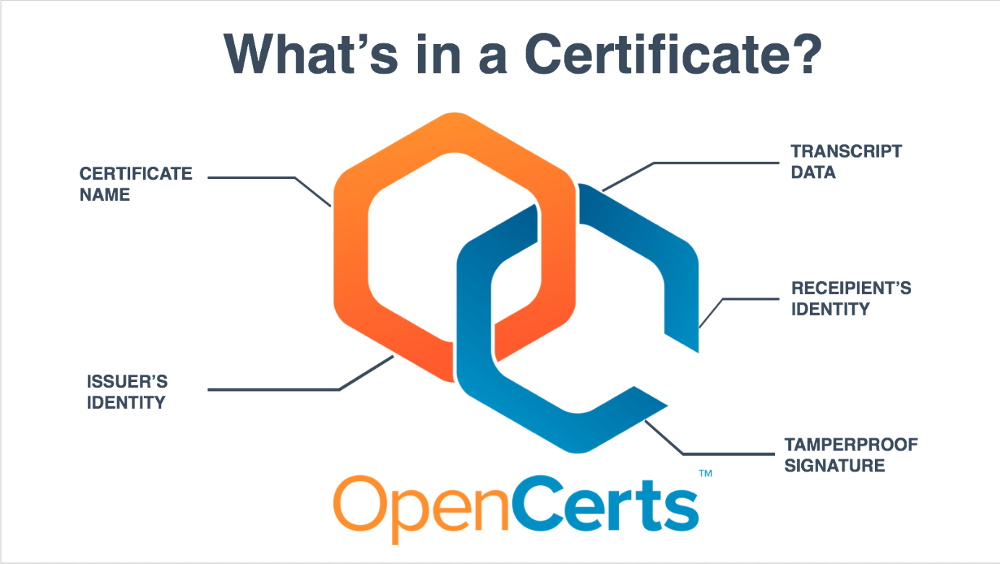
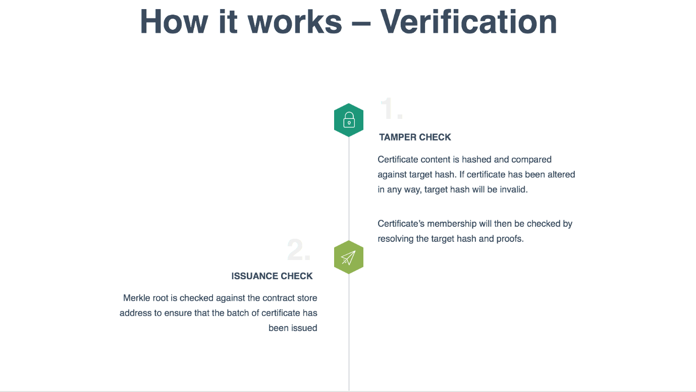
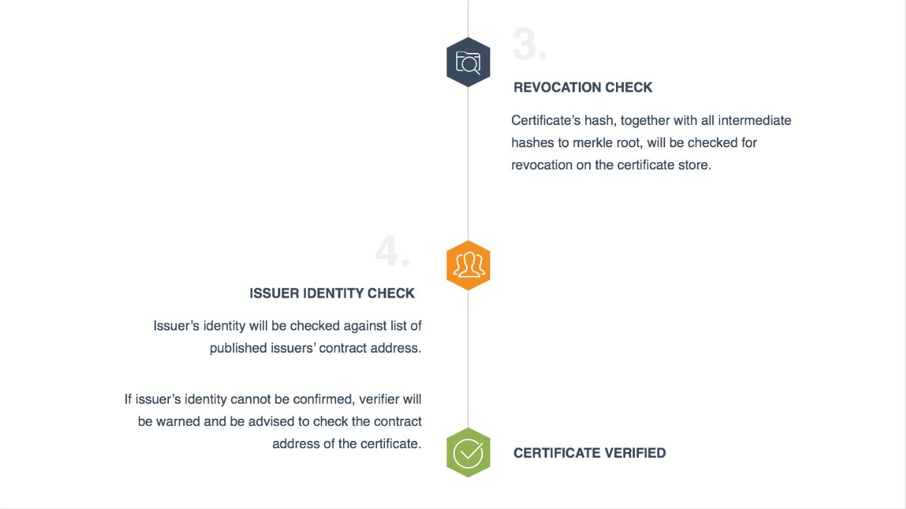
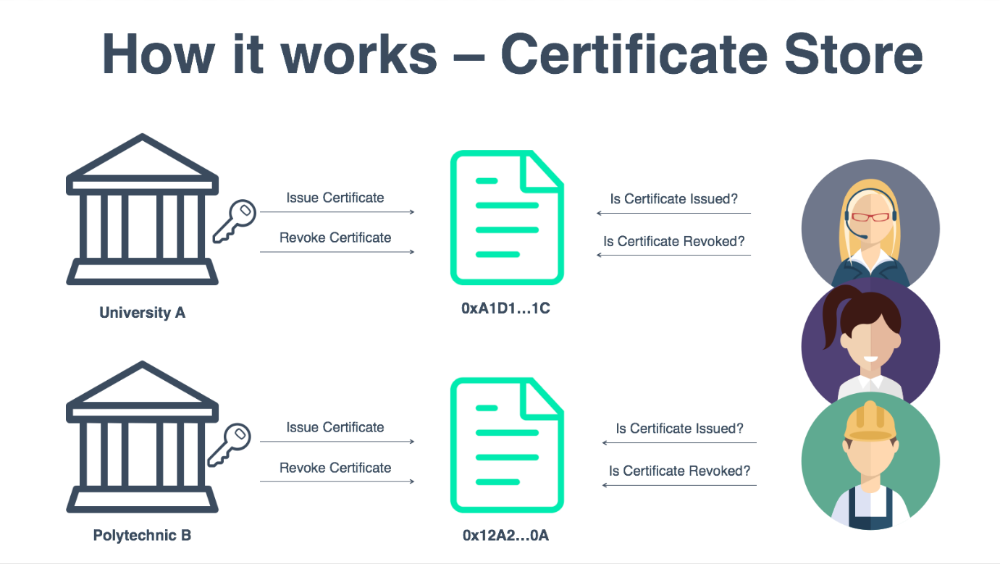
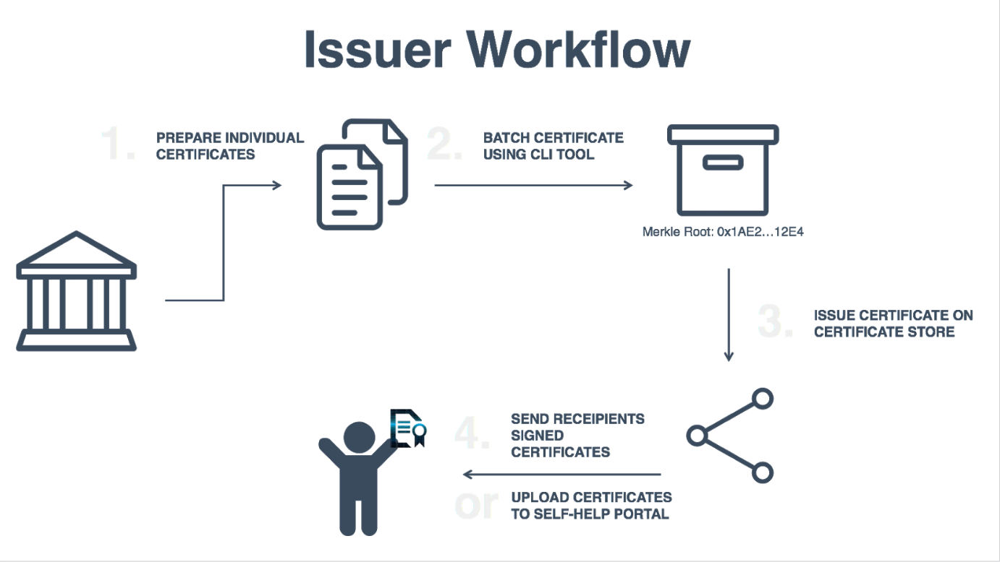
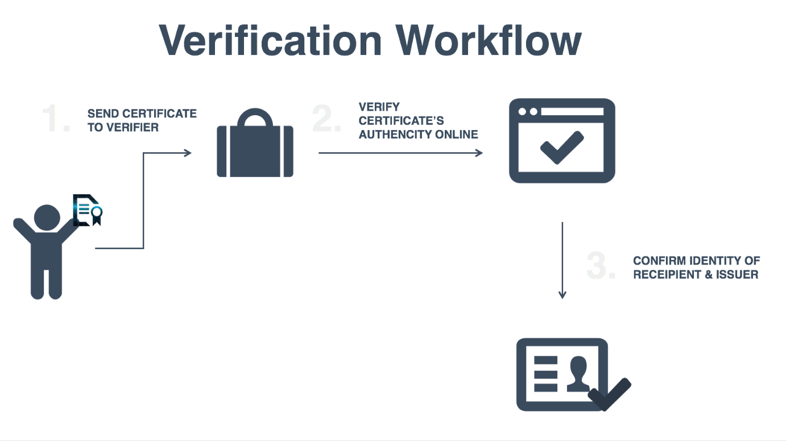
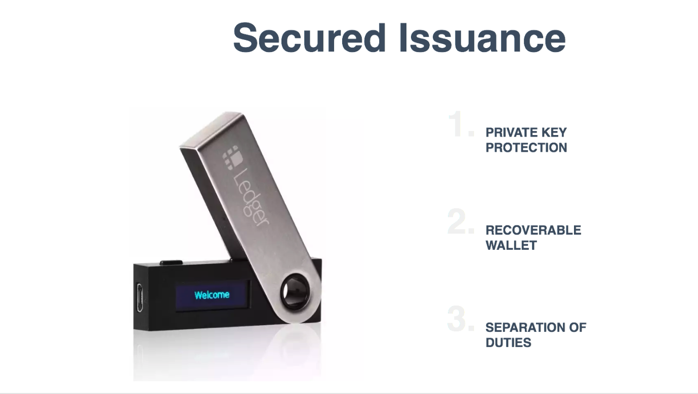

# Introduction

OpenCerts is a digital certificate anchored onto the Ethereum blokchain. 

## What is an OpenCerts

Each certificate is a file that contains all the certificate data which are machine readable and easy to verify.

These certificates can be viewed on the website [OpenCerts.io](https://opencerts.io/). While a generic template is available for all certificates, education institutes may provide a rendering template to customise the look and feel of the rendered data in the certificate.

## Verification of certificates

When a certificate is dropped into the viewer, the viewer will perform a 4 step verification to ascertain that the certificate presented is indeed valid.

## What is on the Ethereum Blockchain

As certificates are issued by individual education institutes, each institute is responsible for maintaining their own registry of certificates issued.

A certificate store is deployed onto the Ethereum blockchain to store the state of all the issued and revoked certificates by the institutes. These certificate stores can be uniquely identified by their public addresses on Ethereum and serves as the identifier for the indivudual institutes. 

The public can then query the certificate store smart contract to check if a certificate has been issued or revoked. 

## Reducing Transactions on Ethereum

Every transaction that alters the state on the blockchain costs ethers. This means issuing and revoking certificates will cost ether but reading the status of issuance or revocation is free. 

To reduce the amount of transaction fees paid to the network, OpenCerts employs a batching algorithm to group the issuance of many certificates into a single transaction. This will allow the institutes to issue up to tens of thousands of certificates with just one transaction.

# Workflow

## Issuer Workflow

## Verification Workflow

# Secured Issuance

