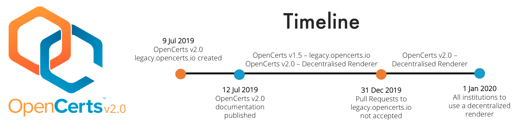

# OpenCerts v1 to v2

As OpenCerts scales and more institutions use our service, it has been difficult to manage the multitude of pull requests to our github repository. OpenCerts v2.0 resolves that difficulty - no more pull requests and institutions save time by not waiting for pull requests to be approved!

With effect from 31 December 2019, OpenCerts.io will be shifting to the use of an institute's own decentralised renderer to render their own certificates. This document will provide information on what you need to know to migrate to OpenCerts v2.

## Announcments

### Repository Change

With OpenCerts v2.0, **no** pull requests for adding/modifying certificates should be made to the original github repository at [https://github.com/OpenCerts/opencerts-website](https://github.com/OpenCerts/opencerts-website).

The process for registering your institution with OpenCerts remains the same.

For any OpenCerts v1.5 and below, pull requests should be made to the decentralised renderer created for these legacy certificates. The new github repository can be found at [https://github.com/OpenCerts/legacy-templates](https://github.com/OpenCerts/legacy-templates).

**NOTE:** No new templates will be accepted to [https://github.com/OpenCerts/legacy-templates](https://github.com/OpenCerts/legacy-templates), only changes to existing templates will be accepted.

### Cutoff for legacy.opencerts.io

After 31 December 2019, no pull requests for adding certificates to legacy.opencerts.io will be accepted. Instead, institutes will have to create and host their own decentralised renderer to use the OpenCerts platform.

### Schedule

The timeline below illustrates for institutes, the transition from OpenCerts v1.5 to v2.0.

## OpenCerts Schema 2.0

### What does it (Decentralisation) mean for you?

1. No more pull requests to [https://github.com/OpenCerts/opencerts-website](https://github.com/OpenCerts/opencerts-website)

   This means that we will no longer have to approve your pull requests and you will not have to wait for us to merge your pull requests. Now, you can make changes to your codebase without any time lags, improving the speed and efficiency of deploying certificates.

2. Fault tolerance

   Decentralized renderers are less likely to fail from other institutions' code errors. This is because each decentralised renderer is reliant on what YOU do, so you can create your certificates with the comfort of knowing that your certificate code is safe from external parties.

3. Anyone can participate

   Going back to the concept of the web, OpenCerts v2.0 will be a shared network of individually owned decentralisd renderer and the OpenCerts platform, in which everyone participates equally.

   If you want to create a certificate, just host your document renderer, create your own custom certificate, and issue your certificate!

### What are the key differences?

### Schema Change

### How do I migrate?

We have updated our documentation at [http://docs.opencerts.io](http://docs.opencerts.io) to include information on how to transition to OpenCerts v2.0. The image below highlights the difference in steps between OpenCerts v1.5 and v2.0, from creating to issuing your certificate.

**IMPORTANT** Refer to [http://docs.opencerts.io](http://docs.opencerts.io) for the documentation on OpenCerts v2.0

## Questions?

Submit an issue at [https://github.com/OpenCerts/opencerts-documentation/issues](https://github.com/OpenCerts/opencerts-documentation/issues).
