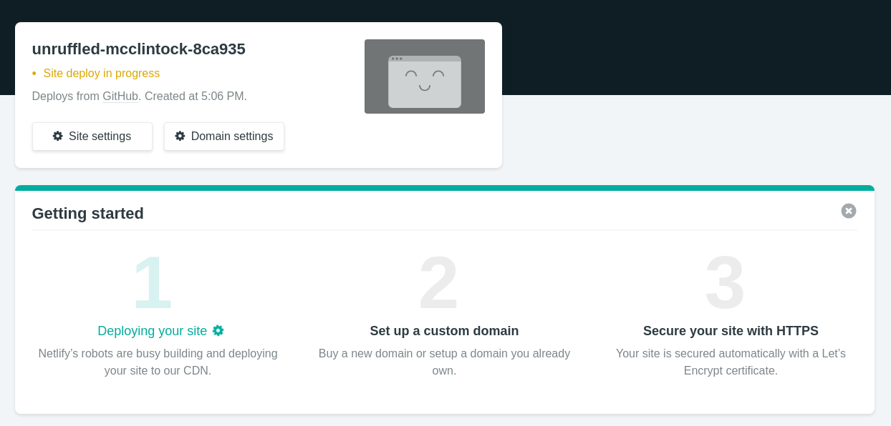

# Document Renderer


This documentation will provide a step-by-step guide of how to setup one's own document renderer.

We will be using the Govtech Demo Cert for this tutorial. The code repository can be found at [https://github.com/OpenCerts/demo-opencerts-renderer](https://github.com/OpenCerts/demo-opencerts-renderer)

## Setup

### Prerequisite

- git

### Clone the document renderer repo

```bash
# Clone the repository
git clone https://github.com/TradeTrust/document-renderer.git
cd document-renderer

# Install dependencies
npm install

# Run the server
yarn start

# Open website served at localhost:3000
open http://localhost:3000
```

You should observe a blank page at this point.

## Configuration

### Template Directory Structure

All the certificate templates are stored in the folder `src/components/templates/`. You should see 2 existing folders - customTemplate and default.
Institutes adding new templates will store their template files as a folder in the templates folder.

Take the below as an example:


In the new custom folder (govtechDemoCert), there will be the corresponding files to its views, ie.
Certificate - `certificate.js`
Transcript - `transcript.js`
Media - `media.js`

Also, notice that there is a `index.js` that you will have to create that will map out these files and enable us to switch between the different views later on the opencerts.io website.

### Custom Templates

To customize your own certificates and transcripts, refer to the documentation on [creating your custom templates for OpenCerts v2.0](./custom_template_v2.md).

### Template index.js

Below is an example on how to format your `index.js` file within your custom template folder, in this case the govtechDemoCert folder.

```javascript
import DemoCert from "./certificate";
import DemoTranscript from "./transcript";
import DemoMedia from "./media";

const templates = [
  {
    id: "certificate",
    label: "Certificate",
    template: DemoCert
  },
  {
    id: "transcript",
    label: "Transcript",
    template: DemoTranscript
  },
  {
    id: "media",
    label: "Media",
    template: DemoMedia
  }
];

export default templates;
```

In the example above, the document rendered using this template will have three views, namely `Certificate`, `Transcript`, and `Media` view.

These three views are imported from the template `./certificate`, `./transcript`, and `./media` respectively.

### Renderer index.js

To register the templates within the renderer, we have to add the custom template folder - govtechDemoCert - to the index.js file of the templates folder, which is located here:


```javascript
import DefaultTemplate from "./default";
import CustomTemplate from "./customTemplate";
import GovTechDemoCert from "./govtechDemoCert"; // Added

export default {
  default: DefaultTemplate,
  CUSTOM_TEMPLATE: CustomTemplate,
  GOVTECH_DEMO: GovTechDemoCert, // Added
  NULL: []
};
```

Import the govtechDemoCert folder and export it as a key-value pair.
The key will be used in the .opencerts file later to reference the folder where the templates are stored.
This key-value pair **MUST NOT** be a duplicate of another existing template's key.

### Registering Templates

To allow the OpenCerts viewer to detect the new certificate templates, the value used in the `$template.name` field **must** equal the key corresponding to the template folder you have created. For example, the unwrapped version of our custom .opencerts file should look like this:

```javascript
const certificate = {
      id: "53b75bbe",
      description: "Govtech Demo Certificate",
      issuedOn: "2019-05-29T00:00:00+08:00",
      $template: {
        name: "GOVTECH_DEMO", // $template.name must corresponding to the key used to reference your template folder
        type: "EMBEDDED_RENDERER", // FOLLOW THIS EXACT VALUE
        url: "https://demo-renderer.opencerts.io/"
      },
      // Other information below
```

### How about other custom templates?

Simple! Just repeat the steps within the **SAME** repository under a new folder.

## Testing your ceritificates

### Testing using the index.html file

To test that your custom certificates work, you can use our index.html in the `/test` folder found in the root directory.
In the test folder, open up the `index.html` file. Replace `const certificate` with your unwrapped certificate shown above.

Then in your terminal, type `yarn start`. Wait for the localhost to load before opening the index.html file.
Click on the `Render Certificate` button and you should see your certificate with its respective tabs displayed!

## Integration test

To ensure that incremental code change does not break your certificate, each template has to be accompanied by it's integration test.

Details on the integration test can be found in the [next chapter](./integration_test.md).

## Hosting your renderer using Netlify

The next step is to host your document renderer on a server for your certificate to reference it in the `$template.url` field.

You also have to upload your custom document-renderer to a **public** Github repository.

### Creating an account with Netlify

Head to [https://www.netlify.com/](https://www.netlify.com/) and sign up for a free Netlify account.

Netlify is a platform that offers hosting and serverless backend services for static websites. You can connect your Github repository and deploy your site.

### Connect with Git

On your Netlify dashboard, click **New site from Git**.

1. Connect to Git provider
   

2. Pick a repository
   Select the document-renderer repository that you have uploaded to Github.
   

3. Build options, and deploy!
   Follow the image below to configure your build options.
   

### Deploying

Once the above steps are completed, you should see this view while waiting for your site to deploy:


## Best Practices for hosting on Netlify

### Custom domain

With a custom domain, you will not have to change the `$template.url` field and re-issue your certificate if netlify is down. Simply host your decentralised renderer on another server using the same custom domain name.

You can also add a custom domain to your site, ie. `$template.url`.


You will also be provided with a default netlify domain as shown below. **Make sure to copy this default domain**. This is the CNAME to add to the DNS later.


Then, add this CNAME to your DNS:


Once the DNS successfully propagates, you should see that your custom domain no longer says "Check for DNS configuration".


### Issue SSL to enable HTTPS

To secure your site, you can enable HTTPS as shown below:


## Issuing new certificate

Now that you have completed the above steps, you can batch and issue your new certificate with the appropriate `$template` fields.

Refer to the chapter on [batching certificates](./batching_certificates.md) and [issuing certificates](./issuing_certificates.md) on how to do this.

An example of how your final certificate should look like is shown below:

```javascript
{
  "schema": "opencerts/v2.0", // OpenCerts v2.0
  "data": {
    "id": "cfb83658-7048-4f2c-b439-19298ad9885f:string:53b75bbe",
    "name": "9683754a-7ec3-45f0-97d7-66ff2ff8a9fe:string:Govtech Demo Certificate",
    "issuedOn": "d650edd4-96dd-4ae8-acf9-12f3217f7fd7:string:2019-05-29T00:00:00+08:00",
    "$template": {
      "name": "44f85973-dc7f-467c-90c4-5dff3c811d56:string:GOVTECH_DEMO", // Key of template folder
      "type": "5ba7eb5c-cb18-4d33-8bf8-d3141638a691:string:EMBEDDED_RENDERER", // Must be EMBEDDED_RENDERER
      "url": "c6bbd4da-7d2b-4006-bd54-63207e730990:string:https://demo-renderer.opencerts.io" // Custom domain where renderer is hosted
    },
      // Other information below
```
