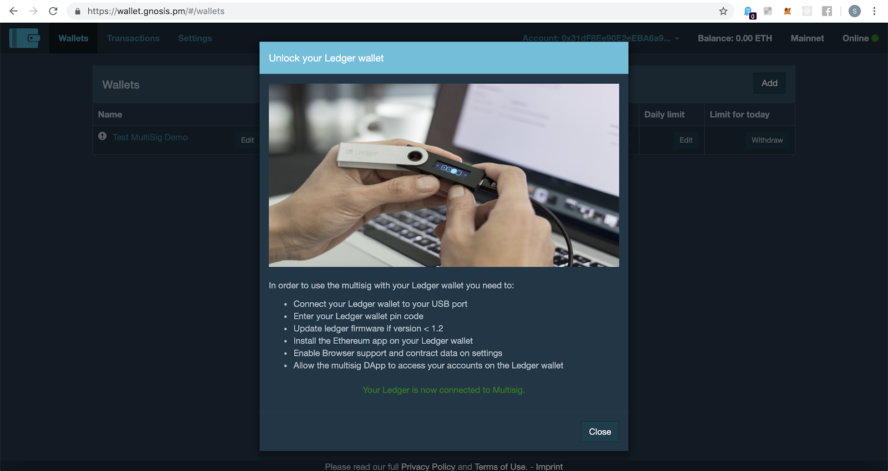
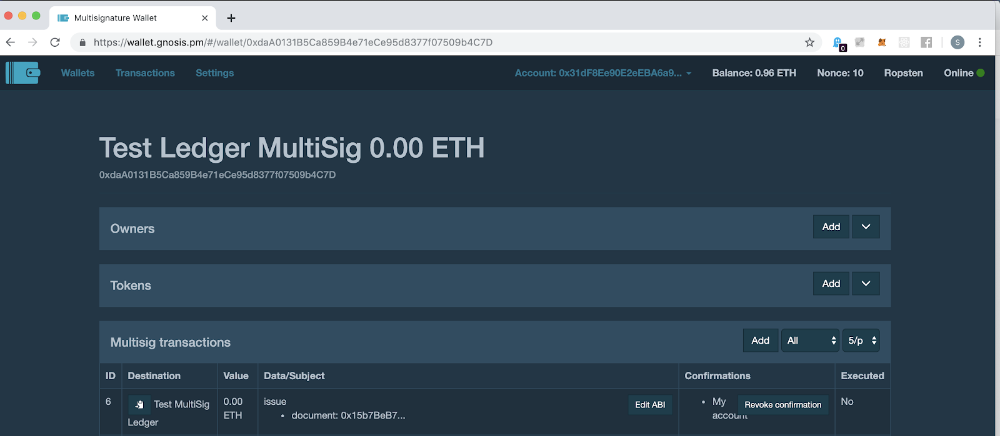

# Issue certificates using MultiSig wallet

## Prerequisites

To issue the certificates, please ensure you have:

1. [Access to a certificate store to issue from](./deploying_store.md)
2. [Merkle root from certificate batch](./batching_certificates.md)

## Issuing Certificates

1. Connect and setup your Hardware Ledger Nano S.
2. Go to [https://wallet.gnosis.pm.](https://wallet.gnosis.pm)
3. Go to settings and make sure you have selected the required network under **“Ethereum Node”**. Ropsten test network for testing purposes and mainnet for production. In Web3 provider select Ledger Wallet and then click **“Update settings”**.

4. Make sure you have selected the ethereum app in your Ledger Nano S. It will prompt and ask to confirm to connect with Ledger Nano S. Click on **“Connect”** and confirm it in the Ledger Nano S. 

5. Once you are connected you will be shown below message. You can see your Ledger wallet address and wallet balance on the right corner.

6. Click on the wallet. You will see the below shown view. Make sure if you are testing you see Ropsten on right top corner and your Ledger wallet address with the balance in it. Now click on the **“Add”** button.

7. Select **“Create new wallet”** and click on **“Next”**.

8. Enter Name, Required confirmations, Daily limit (ETH) and the addresses of the owners and then **“Deploy with factory”**:

    **Name :** Wallet name

    **Required confirmations :** The number of approvals needed from the owners (signatories) of the multisignature wallet (not to be confused with transaction confirmation). Here I enter 2, meaning that at least two people need to sign for a transaction.

    **Daily limit (ETH) :** A limit which could be withdrawn without the need of required confirmations as configured in Required confirmations.

    **ADD :** These are the owner addresses acting as a signatory for changes to the wallet, notably withdrawals, confirmation changes, daily limits, and ownership changes.

9. Click **”Send Transaction”** to deploy MultiSig Wallet but it will need Ether to pay gas fee. Once successful you should be greeted with a **“Deployment transaction was sent”** message on the top right corner.

10. Check your Ledger wallet. Click the right icon in your Ledger wallet to confirm Address, fee and fields. 

11.Once the transaction was confirmed, we can see the wallet showing up in the Wallets tab. Please check whether your transaction is successful if wallet did not show up.

12. Now go to [https://admin.opencerts.io](https://admin.opencerts.io) and deploy the new instance of the store using your Ledger Nano S (follow these instructions [Deploying Store](./deploying_store.md)).
Once successful you should see a message with store address and transaction ID. Click on the transaction ID or go to [https://ropsten.etherscan.io](https://ropsten.etherscan.io)

  

13. Once you’re on [https://ropsten.etherscan.io](https://ropsten.etherscan.io) search for the store address. 

14. Go to **“Write Contract”** tab. You should see a field with transferOwnership. Connect your Ledger wallet to MetaMask. Select the network type either ropsten or mainnet.

    Enter the MultiSig wallet address and click on **“Write”**.

15. In the read contract section you should see MultiSig wallet contract as the owner of this contract.

16. Go back to [https://wallet.gnosis.pm/#/wallets](https://wallet.gnosis.pm/#/wallets). And click on you MultiSig wallet name. You will be redirected to below shown view.

17. Click on the “Add” in MultiSig Transaction tab. 

    **Destination :** Its the store contract address generated in previous step from [https://admin.opencerts.io/](https://admin.opencerts.io/).

    **Contract Name :** Name of the contract (Optional).

    **Amount :** Ethers required to execute the transaction.

    **ABI string :** ABI string of the contract. Go to [https://ropsten.etherscan.io](https://ropsten.etherscan.io) using the store address similar to previous step and click on the code tab. You will see a ABI section copy it and paste it here. 

    **Method :** Once you paste the ABI you will see the methods in that contract. To issue new certificates select “issue” method.

    **Document :** Enter the certificate batch hash generated from certificate-cli.

    Once all the information enter click on the “Send multisig transaction”.

18. You will be prompted with the gas required to execute the transaction. Configure the gas and click on **“Send transaction”**.

19. Check your Ledger wallet. You will be prompted to confirm the address, fee and fields. Click on the right side button to confirm every detail.

20. Once the transaction is mined you will see a transaction in multisig transaction section. You can also revoke your confirmation for this transaction.

21. For owner 2 go to the url [https://wallet.gnosis.pm](https://wallet.gnosis.pm). Connect you Ledger wallet in the setting tab as described above. Then click on the **“Add”** wallet and select the **“Restore deployed wallet”**.

22. Ether the MultiSig wallet name and address and click on **“Ok”**.

23. Now you should be able to see the MultiSig Ledger wallet in your browser too. Click on the wallet name.

24. You can see the MultiSig transactions. Find the transaction which ask you to confirm it.

25. Click on **“Confirm”** then click on **“Send transaction”**.

26. Configure the gas and click on **“Send transaction”**.

27. Confirm the transaction on you ledger wallet. 

28. Once the transaction is mined and the number of required confirmation matches, you should see the output like below image -

    **ID :** transaction id.

    **Destination :** name and address of the store contract address you entered.

    **Value :** Amount of ether transferred in the transaction.

    **Data/Subject :** Merkel hash root you entered.

    **Confirmation :** list of accounts which did the confirmation to execute the transaction.

    **Executed :** If the transaction is executed or not.

