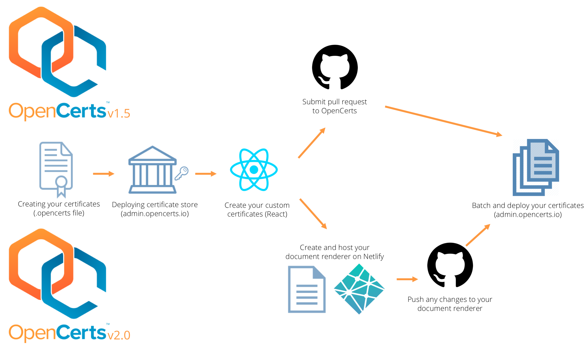
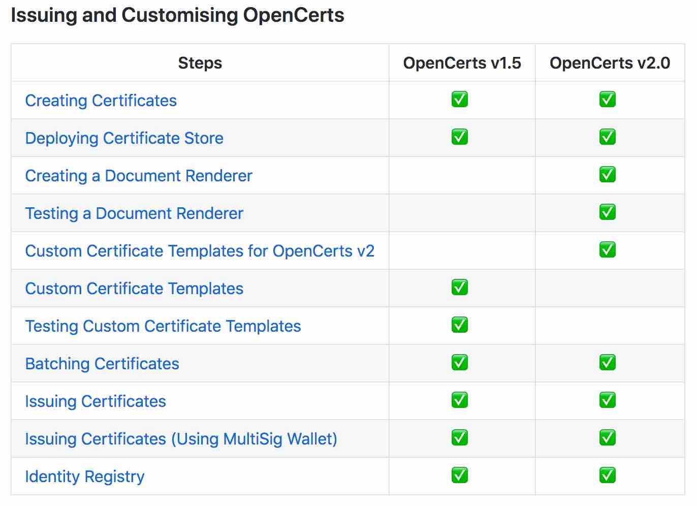
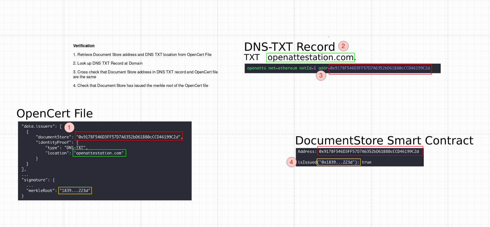

# OpenCerts v1 to v2


As OpenCerts scales and more institutions use our service, it has been difficult to manage the multitude of pull requests to our github repository. OpenCerts v2.0 resolves that difficulty - no more pull requests and institutions save time by not waiting for pull requests to be approved!

With effect from 31 December 2019, OpenCerts.io will be shifting to the use of an institute's own decentralised renderer to render their own certificates. This document will provide information on what you need to know to migrate to OpenCerts v2.

## Announcments

### Repository Change

With OpenCerts v2.0, **no** pull requests for adding/modifying certificates should be made to the original github repository at [https://github.com/OpenCerts/opencerts-website](https://github.com/OpenCerts/opencerts-website).

The process for registering your institution with OpenCerts remains the same.

For any OpenCerts v1.5 and below, pull requests should be made to the decentralised renderer created for these legacy certificates. The new github repository can be found at [https://github.com/OpenCerts/legacy-templates](https://github.com/OpenCerts/legacy-templates).

**NOTE:** No new templates will be accepted to [https://github.com/OpenCerts/legacy-templates](https://github.com/OpenCerts/legacy-templates), only changes to existing templates will be accepted.

### Cutoff for legacy.opencerts.io

After 31 December 2019, no pull requests for adding certificates to legacy.opencerts.io will be accepted. Instead, institutes will have to create and host their own decentralised renderer to use the OpenCerts platform.

### Schedule

The timeline below illustrates for institutes, the transition from OpenCerts v1.5 to v2.0.


## OpenCerts Schema 2.0

### What does it (Decentralisation) mean for you?

1. No more pull requests to [https://github.com/OpenCerts/opencerts-website](https://github.com/OpenCerts/opencerts-website)

   This means that we will no longer have to approve your pull requests and you will not have to wait for us to merge your pull requests. Now, you can make changes to your codebase without any time lags, improving the speed and efficiency of deploying certificates.

2. Fault tolerance

   Decentralized renderers are less likely to fail from other institutions' code errors. This is because each decentralised renderer is reliant on what YOU do, so you can create your certificates with the comfort of knowing that your certificate code is safe from external parties.

3. Anyone can participate

   Going back to the concept of the web, OpenCerts v2.0 will be a shared network of individually owned decentralisd renderer and the OpenCerts platform, in which everyone participates equally.

   If you want to create a certificate, just host your document renderer, create your own custom certificate, and issue your certificate!

### What are the key differences?



### Schema Change


### How do I migrate?

We have updated our documentation at [http://docs.opencerts.io](http://docs.opencerts.io) to include information on how to transition to OpenCerts v2.0. The image below highlights the difference in steps between OpenCerts v1.5 and v2.0, from creating to issuing your certificate.



**IMPORTANT** Refer to [http://docs.opencerts.io](http://docs.opencerts.io) for the documentation on OpenCerts v2.0

## OpenCerts 2.0 DNS-TXT Verification

In OpenCerts 2.0 we are further expanding the reach of the OpenCerts ecosystem by allowing the Domain Name System (DNS) to be used as an identity registry - in addition to our current SkillsFuture Singapore Accreditation Registry. A one-liner introduction to the DNS system can be summarised as: "Phonebook for the Internet". It is indispensible and used by almost all services involving the Internet.

By allowing the DNS system to be used as an identity registry, we let domain name owners claim ownership of an OpenCerts Document Store smart contract on the Ethereum Blockchain.

### Rationale

OpenCerts 1.0 worked on a centralised registry model, governed by SkillsFuture Singapore and administered by GovTech. This created not just a single point of failure but also an unsustainable bottleneck when it came to approvals and identity verification.

OpenCerts 2.0 will continue to use this centralised registry model for the institutions that require a higher level of identity assurance. For issuers without this requirement they will be able to simply tie their issuance to their domain name, (e.g `example.openattestation.com`). When a user views a certificate issued under this model, they will see "Certificate issued by `example.openattestation.com`".

### How it works

Under [IETF RFC 1464](https://tools.ietf.org/html/rfc1464), it is possible to store arbitrary string attributes as part of a domain's record set. This method is currently widely used for [email server authentication](https://en.wikipedia.org/wiki/Email_authentication) (SPF, DMARC, DKIM). Our DNS identity proof technique was largely inspired by [Keybase DNS proofs](https://github.com/keybase/keybase-issues/issues/367).

Only domain name owners (and the registrar that they trust) have the authority to make changes to the records associated with that domain name. Thus when a DNS record endorses a certain fact, it transitively asserts that this fact is believed to be true by the domain name owner.

In an OpenCerts 2.0 DNS-TXT identity proof, we record an OpenCerts Document Store address and the network (e.g Ethereum, Main Net) it is on. In the OpenCert document itself, we declare the domain name to search for the record as well as the Document Store Ethereum address. This forms a bi-directional trust assertion, and if the OpenCert's cryptographic proof is issued on that Document Store - we can say that the domain name owner has endorsed the issuance of this OpenCert document.



A deeper technical discussion of this topic can be found at [OpenCerts 2.0 DNS-TXT Architecture Decision Record](https://github.com/OpenCerts/adr/blob/master/decentralized_identity_proof_DNS-TXT.md)

### Actions to Implement

1. **Create DNS TXT Record**

   The issuer will need to add a DNS TXT record to his domain name, the exact steps to achieve this can be confirmed with their domain name registrar.

   The TXT record should look like

   ```javascript
   openatts net=ethereum netId=1 addr=0x9178F546D3FF57D7A6352bD61B80cCCD46199C2d
   ```

   Optionally, the issuer may also publish an A record at the same address so that the if the certificate viewer clicks on the URL, they can see some helpful text regarding the issuer's OpenCerts program.

2. **Certificate Schema Changes**

   In addition to Decentralised Rendering which will also require schema changes in OpenCerts 2.0, DNS verification adds a field `identityProof` to the issuer object. The issuer will need to already have deployed a Document Store contract as well as created the DNS TXT record as above.

   The identityProof object will look like:

   ```
   "issuers": [
   {
       "network": "ETHEREUM",
       "documentStore": "0x9178F546D3FF57D7A6352bD61B80cCCD46199C2d",
       "identityProof": {
           "type": "DNS-TXT",
           "location": "openattestation.com"
       }
   }
   ]
   ```

## Closing

To sum up, OpenCerts 2.0 is going to be awesome for independent issuers! It allows them to now use OpenCerts completely permissionlessly.

If you have any concerns or questions, please hit us up on our [Github Issuer Tracker](https://github.com/OpenCerts/opencerts-documentation/issues) as always :)
